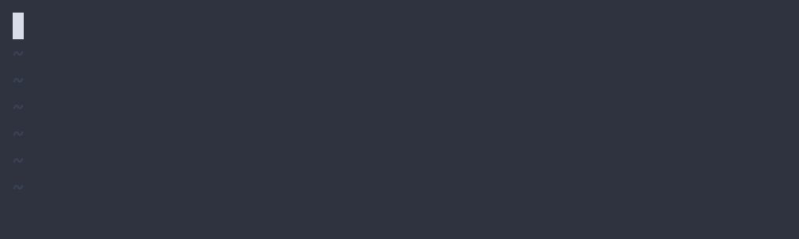
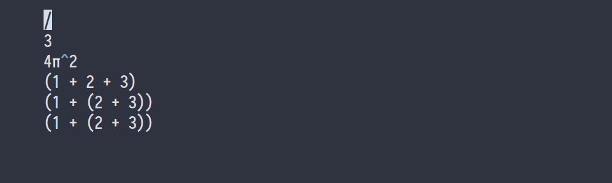
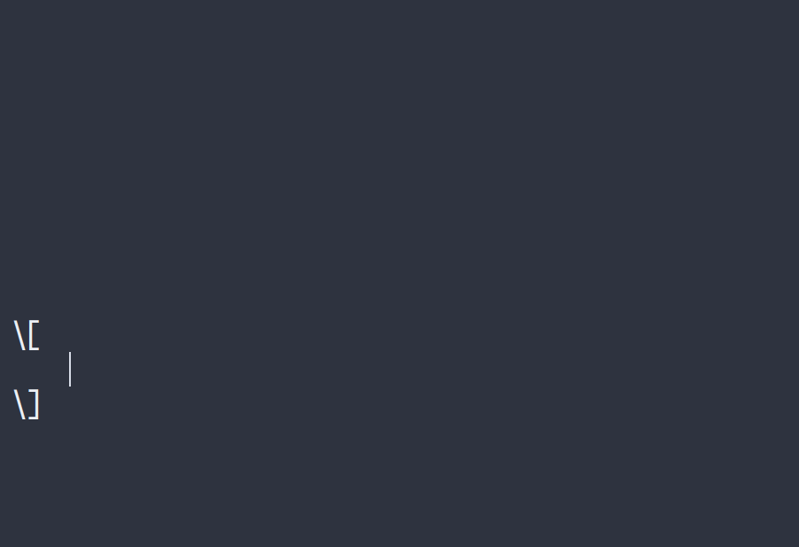
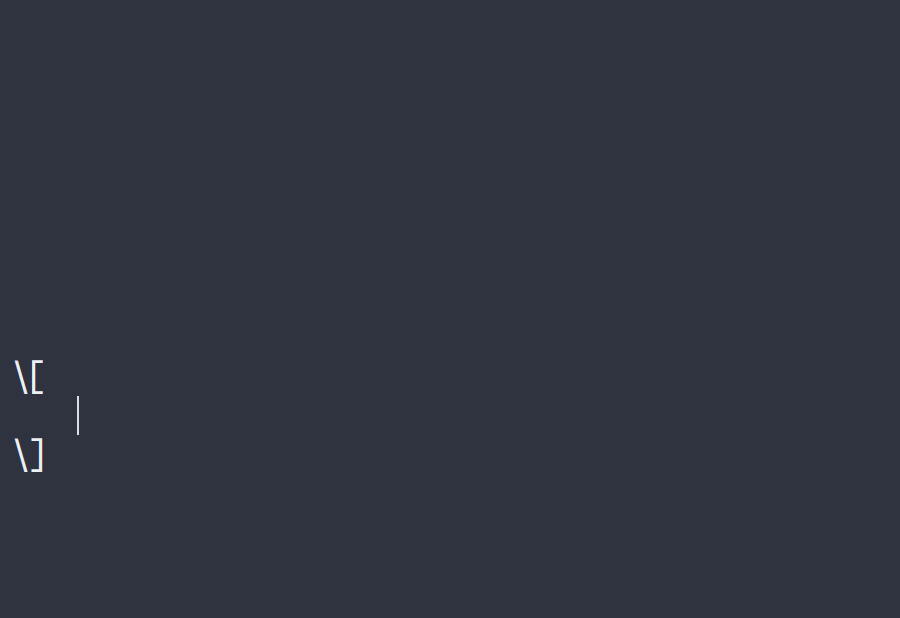
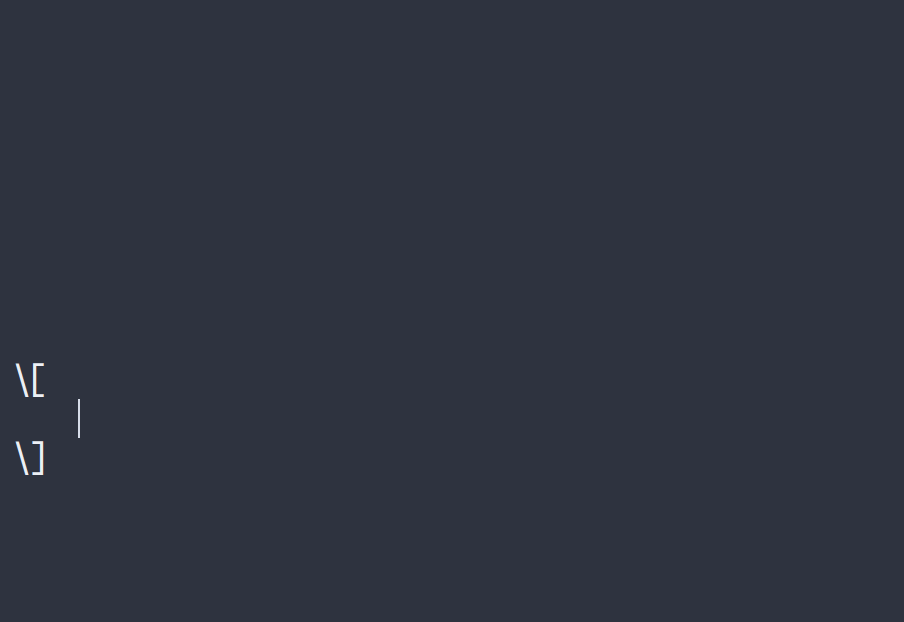

<p align="center">
  <a href="" rel="noopener">
 </a>
</p>

<h3 align="center">Latex Snippets for Vscode</h3>

>_Este [README.md](README-Spanish.md) es una versión en español del [README.md](README.md) en inglés._

<div align="center">

[]()
[](https://github.com/fer334/latex-snippets/issues)
[](https://github.com/fer334/latex-snippets/pulls)
[](/LICENSE)

</div>

---

<p align="center"> Latex Snippets for Vscode es un archivo de configuracion para la extension HyperSnips. Este archivo posibilita la escritura rápida de archivos de tipo latex
    <br> 
</p>

## 📝 Contenido

- [Acerca de](#about)
- [Ejemplos](#example)
- [Empecemos](#getting_started)
- [Uso](#usage)
- [Autores](#authors)
- [Agradecimientos](#acknowledgement)

## 🧐 Acerca De <a name = "about"></a>

Haciendo uso de estos snippets podras escribir codigo en latex de manera muy rapida.

## 🚀 Ejemplos <a name = "example"></a>







## 🏁 Empecemos <a name = "getting_started"></a>

Estas instrucciones te guiaran para la configuracion de la extension y instalación de los snippets.

### Requisitos

Para poder utilizar esta herramienta necesitas:
- La extension para vscode [HyperSnips](https://github.com/draivin/hsnips). El cual puedes encontrarlo en la [pagina de descargas](https://marketplace.visualstudio.com/items?itemName=draivin.hsnips)

- Para utilizar la funcion de calculo automatico, necesitas la libreria [math-expressions](https://github.com/Doenet/math-expressions):

    - Para instalarlo: 
        ```
            npm i math-expressions -g
        ```

### Instalación

Lo primero que se debe hacer es instalar la extension HyperSnips en vscode y activarla.

Luego, hay que dirigirse dependiendo de la plataforma que utilices, a la carpeta de configuracion de la extension HyperSnips:
- Windows: ```%APPDATA%\Code\User\hsnips```
- Mac: ```$HOME/Library/Application Support/Code/User/hsnips```
- Linux: ```$HOME/.config/Code/User/hsnips```

Para tener el archivo de configuración debes clonar el repositorio:
```
git clone https://github.com/fer334/latex-snippets
```

Por ultimo, es necesario recargar la extension HyperSnips para que se apliquen los cambios. Esto es ```Cmd + Shift + P``` y escribir:
```
HyperSnips: Reload Snippets
```

Para probar los snippets, simplemente escribe ```template``` y presiona ```Tab```. Deberias ver un template generado en el editor.


## 🎈 Uso <a name="usage"></a>

En progreso.

## ✍️ Autores <a name = "authors"></a>

- [@fer334](https://github.com/fer334) - Idea y trabajo inicial

Consulte también la lista de [contribuyentes](https://github.com/fer334/latex-snippets/contributors) que participaron en este proyecto. 

## 🎉 Agradecimientos e Inspiraciones <a name = "acknowledgement"></a>

- [latex-snippets](https://github.com/gillescastel/latex-snippets) - La idea de estos snippets es parte de esta herramienta. El autor hizo esta herramienta para que pueda ser utilizada en vim, lo unico que hice fue modificarla para que se pueda utilizar en vscode.
