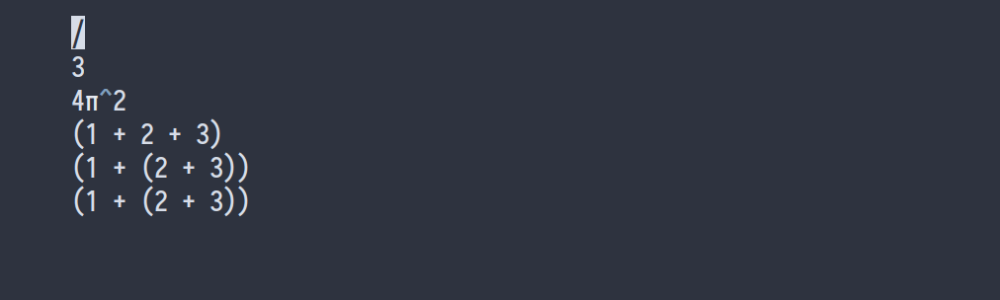
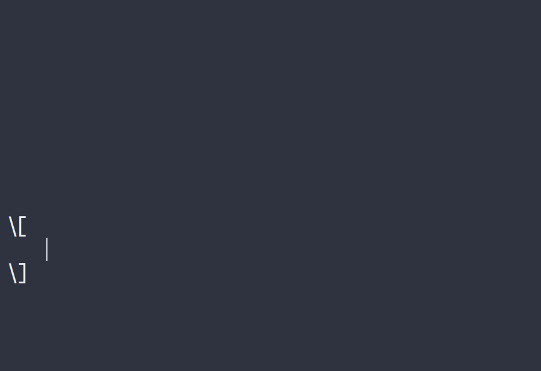

<p align="center">
  <a href="" rel="noopener">
 </a>
</p>

<h3 align="center">Latex Snippets for Vscode</h3>


>_This [README.md](README.md) is the english version, you can read in Spanish at [README-Spanish.md](README-Spanish.md)._

<div align="center">

[]()
[](https://github.com/fer334/latex-snippets/issues)
[](https://github.com/fer334/latex-snippets/pulls)
[](/LICENSE)

</div>

---

<p align="center">
  Latex Snippets for Vscode is a configuration file for the HyperSnips extension. This file enables fast writing of latex files 
    <br> 
</p>

## 📝 Table of Contents

- [About](#about)
- [Examples](#example)
- [Getting Started](#getting_started)
- [Usage](#usage)
- [Authors](#authors)
- [Acknowledgments](#acknowledgement)

## 🧐 About <a name = "about"></a>

Using this snippets, you can write your latex files in a very fast way.

## Examples <a name = "example"></a>







## 🏁 Getting Started <a name = "getting_started"></a>

This steps will guide you to install the latex snippets for vscode.

### Prerequisites

For use this tool you need to have installed:
- Vscode extension [HyperSnips](https://github.com/draivin/hsnips), you can install it from the [vscode extension page](https://marketplace.visualstudio.com/items?itemName=draivin.hsnips)

- To use the calculations function you need to have installed [math-expressions](https://github.com/Doenet/math-expressions)
  - You can install it running the command
    ```
    # npm i math-expressions -g
    ```

### Installing

The first step is install and enable HyperSnips in your vscode.

Then, depending on the platform you are using, you have to go the configuration folder of the Hypersnips extension:
- Windows: ```%APPDATA%\Code\User\hsnips```
- Mac: ```$HOME/Library/Application Support/Code/User/hsnips```
- Linux: ```$HOME/.config/Code/User/hsnips```

For the next step, you need the configuration file for the extension. For this clone the repository and copy the file ```all.hsnips``` to the configuration folder.

Last step is reload the extension. You can do it by pressing ```ctrl + alt + p``` and write ``` HyperSnips: Reload Snippets``` on the pop-up window.

You can now start writing your latex files. Open a new file and write ```template``` and press ```tab``` to generate a latex template. Enjoy


## 🎈 Usage <a name="usage"></a>

Working in progress

## ✍️ Authors <a name = "authors"></a>

- [@fer334](https://github.com/fer334) - Idea & Initial work

See also the list of [contributors](https://github.com/fer334/latex-snippets/contributors) who participated in this project.

## 🎉 Acknowledgements <a name = "acknowledgement"></a>

- [latex-snippets](https://github.com/gillescastel/latex-snippets) - The idea of this project is based on the latex-snippets of [gillescastel](www.github.com/gillescastel), he made the tool to working with vim. I just modified it to work with vscode.